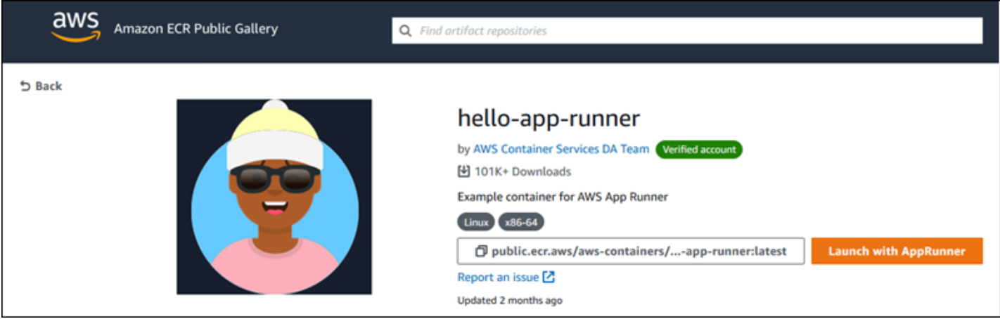

# Launch a service directly from Amazon ECR Public

You can directly launch container images of compatible web applications that are hosted on the Amazon ECR Public Gallery (https://gallery.ecr.aws/) as web services running on App Runner. When browsing the gallery, look for *Launch with App Runner* on the gallery page for an image. An image with this option is compatible with App Runner. For more information about the gallery, see Using the Amazon ECR Public Gallery (https://docs.aws.amazon.com/AmazonECR/latest/public/public-gallery.html) in the Amazon ECR Public user guide.

## Launch a gallery image as an App Runner service

1. On the gallery page of an image, choose *Launch with App Runner*.
    Result: The App Runner console opens in a new browser tab. The console displays the *Create service* wizard, with most of the required new service details pre-filled.

2. If you want to create your service in an AWS Region other than the one that the console is showing, choose the Region displayed on the console header. Then, select another Region.

3. For *Port*, enter the port number that the image application listens on. You can typically find it on the gallery page for the image.

4. Optionally, change any other configuration details.

5. Choose *Next*, review the settings, and then choose *Create & deploy*.

## Use pull through cache from ECR Public to ECR
[Lab-2](/Lab-2-ECR-Pull-through-cache.md)