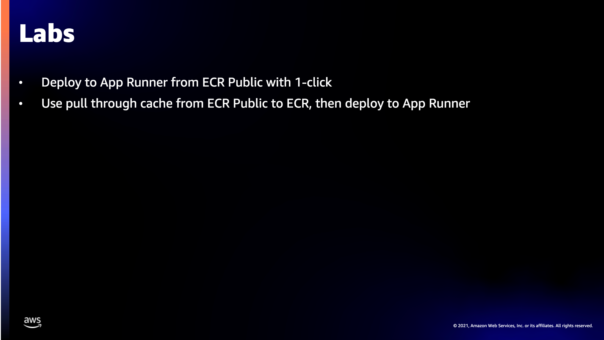

# CON 207

## Labs

## Deploy to App Runner from ECR Public with 1-click
[Lab-1](/Lab-1-One-click-launch.md)

## Use pull through cachefrom ECR Public to ECR
[Lab-2](/Lab-2-ECR-Pul-through-cache.md)